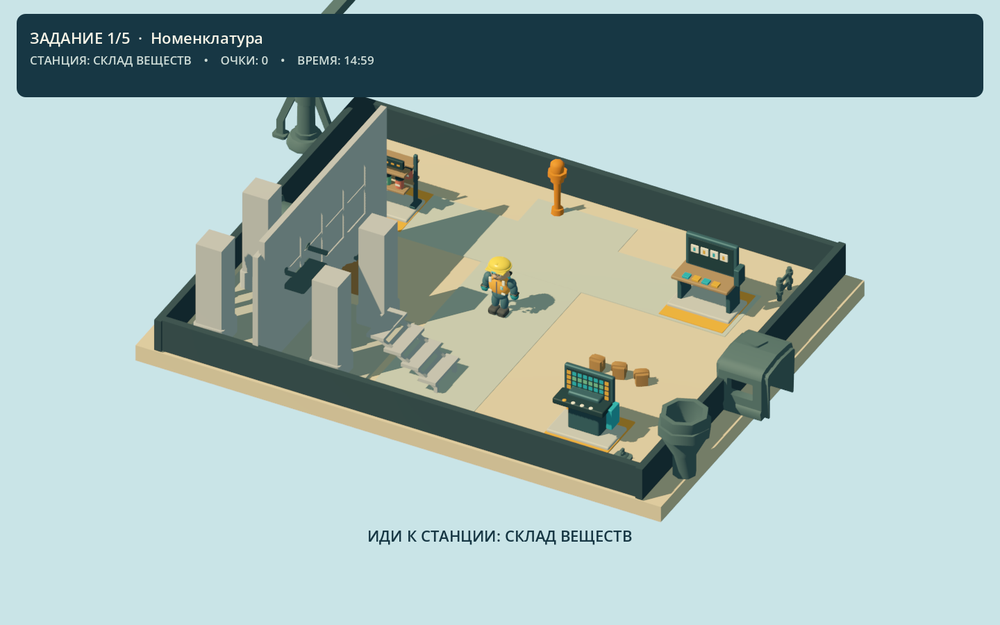
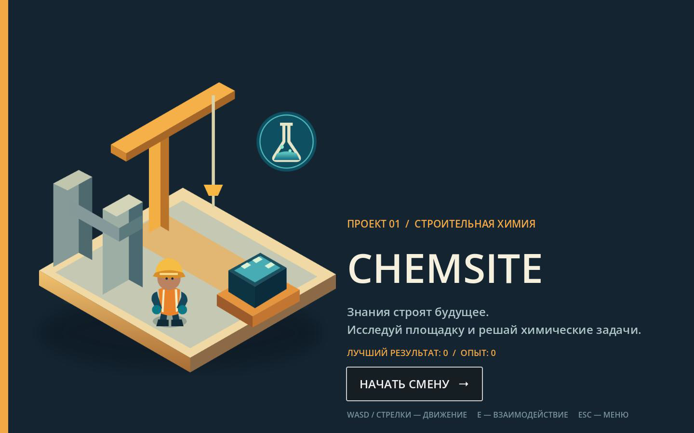

# ChemSite

ChemSite is a single-player desktop chemistry game for first-year Construction and Civil Engineering students. The production runtime is a Godot 4.7 Forward+ project. The completed browser prototype, its 200 curated task seeds, tests, and assets are preserved in [`legacy-web/`](legacy-web/).

## Current native build

The playable native slice has an original rigged character with nine actions, an elevated construction-site camera, three Blender-authored chemistry stations, ten verified Level 1 tasks, a timed five-task round, answer feedback, audio cues, and a versioned local save. A universal macOS release app builds and launches. The environment, UI, effects and gameplay polish are active work.

## Screenshots





## Run

Install Godot 4.7.2, then open `project.godot` in the editor and press F5, or run:

```bash
godot --path .
```

Controls: WASD or arrow keys move, E interacts near a station, Esc opens or closes the pause panel. Use the mouse or keyboard focus to select an answer. The formula board assembles formulas from tokens.

## Desktop build

Install the matching Godot 4.7.2 macOS export template and run:

```bash
godot --headless --path . --export-release macOS builds/macos/ChemSite.app
```

The generated universal app is under `builds/macos/`, which Git ignores. It is currently unsigned and intended for local testing. Windows x86_64 packaging follows the vertical-slice QA gate.

## Validate

```bash
godot --headless --path . --import
godot --headless --path . --script res://tools/validation/smoke.gd
godot --headless --path . --script res://tools/validation/gameplay_smoke.gd
godot --headless --path . --script res://tools/validation/save_smoke.gd
godot --headless --path . --script res://tools/validation/audio_smoke.gd
python3 tools/validation/check_tasks.py
```

`tools/validation/capture.gd` writes a graphical screenshot to `artifacts/godot-site.png` when run with a graphics-capable Godot instance.

## Project organization

- `scenes/`, `scripts/`: native Godot game
- `assets/`: selected runtime models, UI art and audio
- `data/chemistry/`: structured native task data
- `tools/blender/`: reproducible Blender character and station sources
- `docs/`: design, curriculum, chemistry review, and asset provenance
- `legacy-web/`: previous browser game and all 200 curated tasks
- `TODO.md`, `PROGRESS.md`: current production checkpoint

The 200-task curriculum is preserved in the browser archive; the first ten verified tasks power the native slice. Career/Practice modes and later levels remain in production. All experiments are virtual. The game is single-player.
