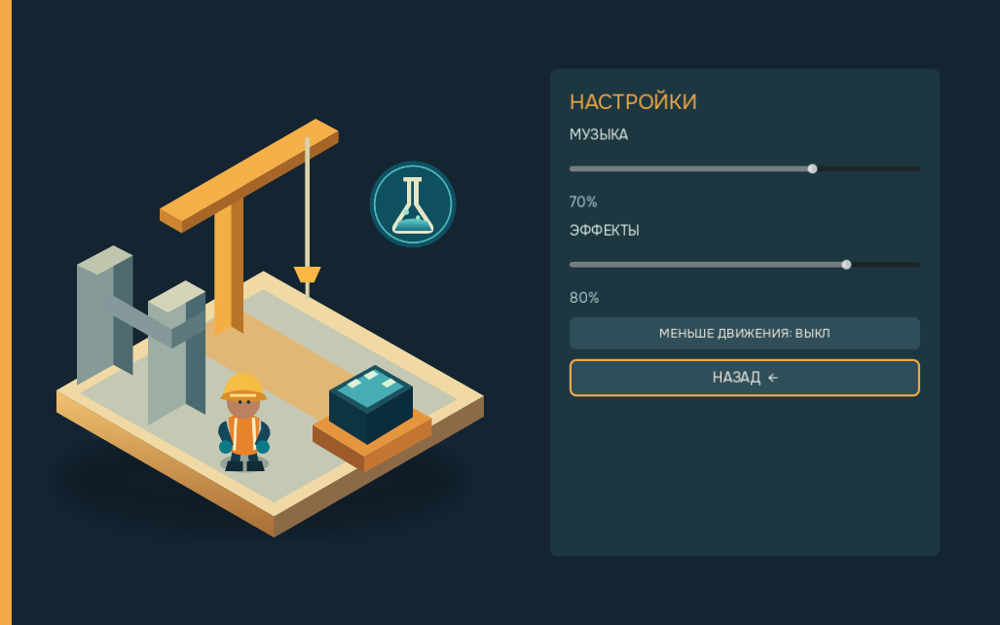

# ChemSite

A single-player 3D chemistry game for first-year Construction and Civil Engineering students. Explore a cartoon construction yard, follow the required-station marker and solve chemistry tasks at interactive workstations.

Built with **Godot 4.7.2, Forward+, GDScript and native desktop UI**. All experiments are virtual. Gameplay and interface text are in Russian.

## Playable features

- **200 curated tasks**, 40 per level, with deterministic answer validation and explanations.
- Five career levels: foundations; reactions; solutions; energy and corrosion; construction chemistry.
- Topic practice across all five levels, with an untimed round of up to five tasks.
- Formula assembly, equations, calculations, virtual measurement, observations and comparisons.
- A detailed cartoon builder with nine skeletal actions, smooth heading and bounded foot planting.
- An enclosed construction yard, eight optional inspections, station guidance and earned construction stages.
- Local progression, topic learning, score, combo, stars and per-level records.
- Keyboard navigation, separate music/effects volume, reduced motion and focus-loss pause.

## Screenshots




## Status

The native macOS app and Windows x86_64 EXE have automated gameplay and export checks. Current verification and unfinished checkpoints are recorded in [PROGRESS.md](PROGRESS.md) and [TODO.md](TODO.md).

Human movement/audio/accessibility acceptance, a representative student-laptop performance test, physical Windows input/audio/save checks and target-course instructor review remain open. The macOS build is unsigned and unnotarized. A preliminary release should carry these limitations in its release notes.

## Run from source

Install Godot 4.7.2, open `project.godot` and press F5, or run:

```sh
godot --path .
```

For a complete checkout including Git LFS assets and reference submodules:

```sh
git clone --recurse-submodules https://github.com/kr1ny77/ChemSite.git
cd ChemSite
git lfs pull
```

| Control | Action |
| --- | --- |
| WASD / arrows | Move |
| E | Interact with a nearby station or inspection |
| Tab / Shift+Tab | Move keyboard focus |
| Space / Enter | Activate the focused control |
| Escape | Pause, close settings or leave topic selection |

## Desktop export

Install matching Godot export templates. Build outputs are ignored by Git.

```sh
godot --headless --path . --export-release macOS builds/macos/ChemSite.app
godot --headless --path . --export-release "Windows Desktop" builds/windows/ChemSite.exe
```

Keep `ChemSite.exe` and `ChemSite.pck` together. Planned download archive names are `ChemSite-macOS.zip` and `ChemSite-Windows.zip`; publish them with checksums, third-party notices and known issues.

[PLAYTEST.md](docs/PLAYTEST.md) describes an isolated exported test profile and the acceptance route. It preserves ordinary player progress and settings.

## Verification

Core source checks:

```sh
godot --headless --path . --import
godot --headless --path . --script tools/validation/gameplay_smoke.gd
godot --headless --path . --script tools/validation/collision_smoke.gd
godot --headless --path . --script tools/validation/save_smoke.gd
godot --headless --path . --script tools/validation/practice_levels_smoke.gd
```

Run graphical UI checks with a working display:

```sh
godot --path . --resolution 1028x642 --script tools/validation/hud_text_contrast_smoke.gd
godot --path . --resolution 1028x642 --script tools/validation/menu_accessibility_smoke.gd
```

The Windows workflows in [`.github/workflows/`](.github/workflows/) export the EXE/PCK, exercise all five career rounds and focused station interactions, and run graphical layout/accessibility checks. Logs and artifacts provide build-specific evidence. See [UI accessibility QA](docs/UI_ACCESSIBILITY_QA.md), [movement QA](docs/LOCOMOTION_CONTACT_QA.md), [audio QA](docs/AUDIO_QA.md) and [chemistry review](docs/CHEMISTRY_REVIEW.md) for scope and remaining checks.

## Project structure

| Path | Contents |
| --- | --- |
| `scenes/`, `scripts/` | Native Godot game |
| `data/chemistry/` | Curated structured tasks and inspection content |
| `assets/` | Runtime models, fonts, UI and audio |
| `tools/blender/` | Editable Blender sources and reproducible asset workflows |
| `tools/validation/` | Source checks and visual capture tools |
| `docs/` | Design, architecture, curriculum, QA and provenance |
| `legacy-web/` | Preserved browser prototype and content history |

## Assets and licenses

Original project assets include the cartoon builder, authored stations/environment additions, UI illustration and deterministic synthesized audio. Selected construction props use Kenney CC0 assets. Onest is distributed under the SIL Open Font License; its license is included at [`assets/fonts/OFL.txt`](assets/fonts/OFL.txt).

See [ASSET_LICENSES.md](docs/ASSET_LICENSES.md) for source paths, modifications and license files. The Godot runtime has its own license and third-party notices, which should accompany downloadable builds.
